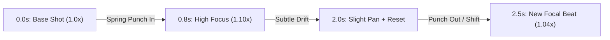

# SPEC-03: DYNAMIC PACING & CAMERA PUNCH ENGINE
**Mã đặc tả:** SPEC-03
**Áp dụng:** `src/DynamicNews/Scene.tsx`, `src/DynamicNews/Background.tsx`
**Mục tiêu:** Thực thi "Quy tắc 2 giây", loại bỏ hoàn toàn các khung hình tĩnh để ngăn chặn hiện tượng lướt video.

---

## 1. Bối cảnh & Vấn đề
- Một cảnh (Scene) trung bình dài từ 6 đến 12 giây.
- Trước đây, camera chỉ thực hiện hiệu ứng phóng to tuyến tính rất chậm (`scale 1.0 -> 1.07` suốt 10 giây). Điều này khiến màn hình trông gần như bất động đối với mắt người xem Shorts, kích hoạt phản xạ vô thức vuốt sang video khác (Retention Cliff).

---

## 2. Chu kỳ Kích thích Thị giác 2 Giây (Attention Reset Cycle)
Trong mỗi Scene, hệ thống Remotion sẽ áp dụng chu kỳ co giãn khung hình tuần hoàn mỗi **60 - 75 frames (2.0 - 2.5 giây)**:



### 2.1. Công thức Toán học Remotion (Attention Reset Formula)
```typescript
// Chu kỳ 66 frames (~2.2s)
const cycleFrames = 66;
const cycleProgress = (frame % cycleFrames) / cycleFrames;
// Tạo nhịp nhấp nhô hữu cơ kết hợp Spring giật góc
const punchScale = 1 + Math.sin(cycleProgress * Math.PI) * 0.08;
const driftPanX = Math.sin(frame * 0.03) * 12;
const driftPanY = Math.cos(frame * 0.03) * 8;
```

### 2.2. Zero-Bumper Frame 0 Hook
- Tại Cảnh 1 (0s - 3s):
  - Khung hình bắt đầu ngay ở frame 0 với tỷ lệ phóng đại **1.18x** và giật mạnh về **1.0x** trong 15 frames đầu bằng `stiffness: 280, damping: 14`.
  - Kết hợp với huy hiệu chủ đề (`BREAKING` / `TIN NÓNG`) nhấp nháy phát sáng (Glow Pulse).

---

## 3. Quản lý Đa Lớp B-Roll (Multi-Asset Visuals)
- Đối với các cảnh dài trên 7 giây:
  - Cho phép phân chia hiển thị: 0s - 4s hiển thị hình ảnh báo chí / hiện trường, từ 4s - hết cảnh chuyển động chuyển đổi sang Thẻ số liệu (`stat`) hoặc Luận điểm then chốt (`takeaways`) kèm âm thanh pop/whoosh.
