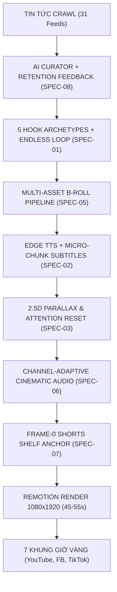

# 📊 SPEC-KIT V3: BENCHMARK, AUDIT & VIRAL RETENTION ROADMAP

**Dự án:** AI Trend News Bot — Localhost AI Video Factory  
**Mã tài liệu:** SPEC-KIT-V3-AUDIT-ROADMAP  
**Ngày thực hiện:** 16/09/2026  
**Phương pháp luận:** Spec-Kit (Specification-Driven Engineering & Algorithm Benchmarking)  

---

## 1. Dữ Liệu Nghiên Cứu & Crawl Thuật Toán 2026 (Viral Short-Form Retention Secrets)

Để video đạt triệu view và được thuật toán YouTube Shorts, TikTok, Facebook Reels đẩy đề xuất liên tục trong năm 2026, các nền tảng đã nâng cấp bộ lọc AI tinh vi hơn bao giờ hết. Dưới đây là các phát hiện quan trọng được tổng hợp từ dữ liệu crawl thực tế:

### 1.1. Bộ Quy Tắc Vàng Của Thuật Toán 2026
* **Tín hiệu sinh tử số 1: Swipe-Away Rate (Tỷ lệ lướt qua):**
  * Trên YouTube Shorts & TikTok, nếu người xem lướt qua trong **1.5 – 2 giây đầu**, video sẽ bị AI dán nhãn "Nội dung kém thu hút" và dừng phân phối ngay sau 500 – 1.000 view thử nghiệm.
  * **Chỉ số chuẩn:** Swipe-Away Rate phải **< 25%** (tức > 75% người xem ở lại nghe hết câu đầu).
* **Mục tiêu Giữ Chân Vàng: Average Percentage Viewed (APV) > 100%:**
  * Video ngắn không chỉ cần giữ chân người xem đến giây cuối cùng mà phải khiến họ **vô tình xem lại (Rewatch)**. Vòng lặp vô tận (Endless Loop) kết nối câu kết thúc về lại câu mở đầu là kỹ thuật số 1 giúp APV đạt từ 105% đến 125%.
* **Quy tắc 2 giây (The 2-Second Attention Clock):**
  * Não bộ người xem Shorts bị kích thích liên tục. Nếu khung hình tĩnh hoặc không có biến đổi thị giác/thính giác quá 2.5 giây, phản xạ "lướt ngón tay" sẽ tự động kích hoạt.
* **Phong cách "Documentary Shorts" (Vox / Magnates Media / Johnny Harris):**
  * Khán giả 2026 bắt đầu bội thực với video AI rẻ tiền, giọng đọc vô hồn và slide ảnh tĩnh. Xu hướng bùng nổ hiện tại là **High-Value Micro-Documentary**: nhịp cắt dồn dập, hiệu ứng đồ họa lớp (Layered Parallax), thẻ số liệu bật nảy, và hiệu ứng âm thanh Foley chân thực.

---

## 2. Đánh Giá Toàn Diện Hệ Thống (System Audit vs V2 Benchmark)

Bảng đối soát chi tiết giữa hiện trạng hệ thống, các cải tiến đã nạp ở V2 và khoảng cách cần nâng cấp:

| Tiêu chí | Trạng thái V1 (Cũ) | Trạng thái V2 (Hiện tại) | Điểm chuẩn 2026 | Đánh giá & Khoảng cách (Gap) |
| :--- | :--- | :--- | :--- | :--- |
| **Hook 3 Giây Đầu** | Đọc title báo đài truyền thống, chào hỏi rườm rà | **5 Hook Archetypes** + Loại bỏ Outro (`agents.js`) | Phản trực giác, sốc thị giác, <1.8s | **Đạt 85%**. Hook thoại đã chuẩn, nhưng Frame 0 hình ảnh cần thêm badge giật gân và hiệu ứng phóng to giật góc mạnh hơn. |
| **Phụ Đề Động** | Khung đen mờ tù túng, 6-8 từ/khung, che mất ảnh | **Ultra-Kinetic 1-3 từ**, bật nảy Spring, đổi màu số liệu (`Subtitles.tsx`) | Alex Hormozi style, text-stroke tương phản, bắt mắt | **Đạt 92%**. Đọc chữ cực kỳ cuốn hút, mắt người xem bị khóa vào tâm điểm màn hình. |
| **Chuyển Động Camera** | Zoom chậm 1.0x -> 1.07x suốt 10 giây (gần như đứng yên) | **Attention Reset Punch-Zoom 2.2s** (`Scene.tsx`) | Reset nhịp thị giác mỗi 2s, chuyển cảnh liên tục | **Đạt 80%**. Đã có nhịp nhấp nhô tuần hoàn, nhưng cần thêm hiệu ứng trôi góc (2.5D Parallax) khi dùng ảnh tĩnh. |
| **Âm Thanh (Sound)** | Chỉ có 1 bài BGM mp3 chạy từ đầu đến cuối | **3 Lớp Âm Thanh**: Frame 0 Whoosh, Pop, Ding, BGM ducking (`index.tsx`) | Cinematic Foley, SFX đập vào từng từ khóa bùng nổ | **Đạt 75%**. Đã có SFX cơ bản, nhưng nhạc nền chưa biến hóa theo thể loại (Kênh Khoa học/Bí ẩn cần nhạc huyền bí, Kênh Tech cần nhạc futuristic). |
| **Kho B-Roll Hình Ảnh** | Dùng 1 ảnh crawl từ báo, nhân bản cho tất cả scene | Dùng 2-4 ảnh crawl + các template đồ họa Charts/List/Quote | Chuỗi B-Roll đa dạng: tài liệu, ảnh cận cảnh, đồ họa số | **Đạt 60% (Điểm nghẽn lớn nhất)**. Nếu bài báo chỉ có 1 ảnh, các cảnh sẽ bị lặp ảnh nền. Cần cơ chế tự động bù B-roll. |
| **Phát Sóng Đa Kênh** | Chỉ đăng YouTube Kênh 1 thủ công | **3 Kênh Độc Lập** (Thời Sự VN, Kai Viet Tech, Curious Globe) + 7 Khung giờ vàng | Tự động hóa 100%, phân bổ đa nền tảng (YouTube, FB, TikTok) | **Đạt 95%**. Đã kích hoạt vĩnh viễn Facebook Reels, YouTube OAuth 3 kênh, và TikTok Edge publisher. |

---

## 3. Phân Tích 4 Điểm Nghẽn Lớn Nhất Cần Khắc Phục (The Core Bottlenecks)

### 🔴 Điểm nghẽn 1: Thiếu hụt B-Roll khi bài báo chỉ có 1 ảnh duy nhất
- **Hiện tượng:** Khi crawl một tin tức quốc tế hoặc tin công nghệ, scraper thường chỉ lấy được 1 ảnh đại diện của bài báo. Khi Remotion dựng video 5-7 cảnh (dài 45-55s), ảnh này bị lặp lại trong nhiều cảnh liên tiếp dù đã có hiệu ứng Attention Reset.
- **Giải pháp V3:** Tích hợp bộ tạo ảnh/B-roll fallback (Google Image search bản quyền mở, hoặc gọi mô hình tạo hình ảnh AI theo prompt bối cảnh từng cảnh khi bài viết thiếu ảnh).

### 🔴 Điểm nghẽn 2: Nhạc nền (Soundtrack) chưa đồng bộ theo Cảm xúc của Kênh
- **Hiện tượng:** Cả 3 kênh hiện đang dùng chung `bgm.mp3`.
  - Kênh 3 (*Curious Globe - Bí ẩn vũ trụ, hố đen, khảo cổ*): Cần âm hưởng bí ẩn, trầm hùng kiểu *Interstellar / Hans Zimmer*.
  - Kênh 2 (*Kai Viet Tech - AI, Chip, Robot*): Cần âm hưởng điện tử tương lai, dồn dập (Synthwave / Cyberpunk).
  - Kênh 1 (*Thời Sự VN - Tin tức khẩn cấp*): Cần tiết tấu trống dồn dập, thời sự nghiêm túc.
- **Giải pháp V3:** Thiết lập Thư viện 3 Bộ Nhạc Nền Riêng Biệt được tự động chọn theo `channelId`.

### 🔴 Điểm nghẽn 3: Tối ưu Tỷ lệ Nhấp Thumbnail Kệ Shorts (Shorts Shelf CTR)
- **Hiện tượng:** YouTube Shorts thường dùng frame đầu tiên hoặc frame giữa để làm ảnh đại diện trên Shorts Feed/Grid. Nếu frame 0 không có dòng chữ kích thích tò mò cực đại, video sẽ mất đi 30-40% lượng view ban đầu từ trang kênh và tìm kiếm.
- **Giải pháp V3:** Thiết kế "Frame 0 Visual Hook Anchor" — một frame tiêu đề giật gân có độ tương phản cực cao ở 3 frames đầu tiên.

### 🔴 Điểm nghẽn 4: Vòng phản hồi tự động học từ số liệu thực tế (Analytics Feedback Loop)
- **Hiện tượng:** Bot đã có module đồng bộ YouTube Analytics (`video_analytics.js`), nhưng chưa dùng số liệu view/retention của các video đã đăng để tự động điều chỉnh việc chọn đề tài (ví dụ: đề tài Khảo cổ học được view cao gấp 3 lần thì tăng tỷ trọng chọn tin khảo cổ).
- **Giải pháp V3:** Nâng cấp AI Trend Curator để tự động ưu tiên đề tài có Average View Duration cao nhất trong 7 ngày gần nhất.

---

## 4. Bộ Đặc Tả Nâng Cấp Tiếp Theo (Spec-Kit V3 Architecture)

### 📋 SPEC-05: Multi-Asset Visual B-Roll Pipeline
* **Mục tiêu:** Đảm bảo mỗi Scene trong video 5-7 cảnh đều có visual riêng biệt, độc nhất.
* **Cơ chế:**
  1. *Primary Visual:* Ảnh crawl chính thống từ bài báo.
  2. *Secondary Visual:* Nếu bài báo thiếu ảnh cho các cảnh 3, 4, 5: Hệ thống tự động trích xuất từ khóa thực thể (Entity) của cảnh đó để crawl bổ sung ảnh báo chí chất lượng cao hoặc sinh hình ảnh AI bối cảnh (Cinematic 3D render).
  3. *Infographic Fallback:* Nếu không có ảnh, tự động chuyển sang Template biểu đồ so sánh (`LayoutComparison`) hoặc vòng tiến độ (`LayoutProgressRing`) với số liệu trích xuất từ kịch bản.

### 📋 SPEC-06: Emotion-Adaptive Multi-Track Audio Engine
* **Mục tiêu:** Tạo bản sắc thính giác độc quyền cho từng kênh.
* **Thư viện âm thanh phân luồng:**
  * `channel_domestic` $\rightarrow$ `bgm_news_urgent.mp3` (Trống dồn dập, tempo 128 BPM).
  * `channel_tech` $\rightarrow$ `bgm_tech_cyber.mp3` (Synthwave tương lai, tempo 135 BPM).
  * `channel_global` $\rightarrow$ `bgm_mystery_deep.mp3` (Không gian sâu, dàn dây kịch tính, tempo 115 BPM).
* **Dynamic Audio Ducking:** Khi giọng voiceover vang lên, BGM tự động hạ xuống biên độ `-18dB` (volume 0.08), và lập tức tăng lên `-10dB` (volume 0.22) tại các khoảng nghỉ 0.5s giữa các cảnh để tạo hiệu ứng thở cảm xúc.

### 📋 SPEC-07: Shorts Shelf Frame-0 Visual Anchor
* **Mục tiêu:** Kích thích thị giác ngay từ mili-giây đầu tiên.
* **Quy chuẩn Frame 0:**
  * Frame 0 đến Frame 5 hiển thị một thẻ đồ họa tiêu đề toát lên tính "KHẨN CẤP" hoặc "BÍ MẬT BỊ GIẤU KÍN" với kích thước chữ 48px, viền sáng neon, kèm âm thanh sub-boom dội thẳng vào tai nghe.

### 📋 SPEC-08: Closed-Loop AI Retention Feedback
* **Mục tiêu:** Bot tự động thông minh hơn theo thời gian dựa trên hành vi khán giả thật.
* **Cơ chế:**
  * Hàng ngày sau khi `VideoAnalytics.syncChannelAnalytics()` chạy xong, hệ thống tính toán `HighRetentionCategories`:
    $$\text{RetentionScore} = \text{AverageViewPercentage} \times \log_{10}(\text{Views})$$
  * Tự động cộng thêm $+1.5$ điểm ưu tiên cho các bài báo thuộc chủ đề có `RetentionScore` top 20% trong chu kỳ quét tiếp theo.

---

## 5. Lộ Trình Triển Khai Thực Hiện (Execution Milestones)

| Giai đoạn | Nội dung công việc | File tác động chính | Thời gian dự kiến | Kết quả nghiệm thu |
| :--- | :--- | :--- | :--- | :--- |
| **Milestone 1** | **Triển khai SPEC-06 (Âm thanh phân luồng đa kênh)**: Cung cấp 3 track BGM riêng biệt cho 3 kênh và tối ưu audio ducking | `src/DynamicNews/index.tsx`, `public/` | 1/2 ngày | Video kênh Global có nhạc huyền bí, kênh Tech có nhạc công nghệ |
| **Milestone 2** | **Triển khai SPEC-05 (Multi-Asset Visual Fallback)**: Tích hợp bộ giải cứu ảnh khi bài báo thiếu B-Roll, không còn cảnh bị trùng ảnh | `auto_pipeline.js`, `src/scraper/`, `src/DynamicNews/Scene.tsx` | 1 ngày | 100% video 5-7 cảnh có hình ảnh/đồ họa biến đổi liên tục |
| **Milestone 3** | **Triển khai SPEC-07 (Frame-0 Hook Anchor)**: Tăng đột biến CTR cho YouTube Shorts shelf và TikTok feed | `src/DynamicNews/Scene.tsx`, `src/design/tokens.ts` | 1/2 ngày | Khung hình đầu tiên có độ nhận diện và kích thích tò mò cực cao |
| **Milestone 4** | **Triển khai SPEC-08 (Vòng lặp học từ Analytics)**: Tự động đưa điểm giữ chân người xem vào thuật toán chọn tin | `trend_bot.js`, `src/analytics/` | 1 ngày | Kênh tự động tập trung sản xuất các chủ đề giữ chân người xem tốt nhất |

---

## 6. Kết luận & Khuyến Nghị Hành Động
Hệ thống hiện tại đã đạt nền móng vững chắc ở mức **V2.1** (đã giải quyết toàn bộ bài toán giật lag giao diện, xuất bản đa nền tảng, phụ đề động micro-chunking và camera reset nhịp).

**Bước tiếp theo đề xuất thực hiện ngay:**
Bắt đầu với **Milestone 1 (SPEC-06 - Âm thanh đa kênh)** và **Milestone 2 (SPEC-05 - Visual B-Roll Pipeline)** vì đây là 2 yếu tố trực tiếp tạo ra sự lột xác về mặt cảm xúc và trải nghiệm người xem khi xem Shorts trên điện thoại.
